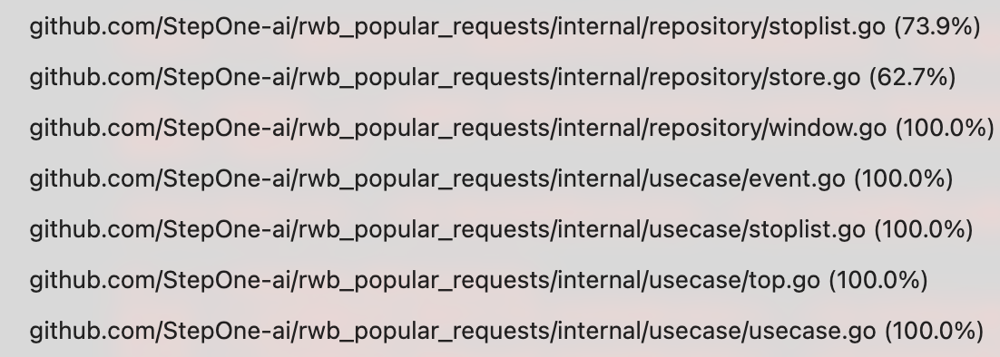
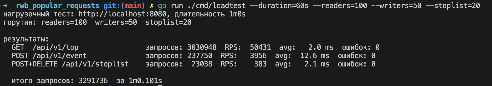
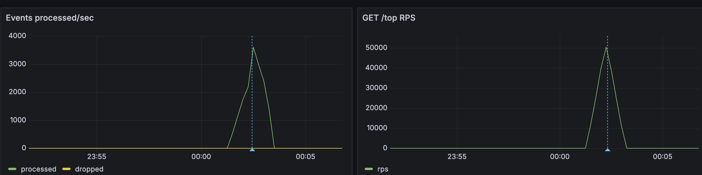

# Popular Requests

Сервис для виджета "Сейчас ищут" на главной странице маркетплейса. Принимает поток поисковых событий из Kafka, считает топ уникальных запросов за последние 5 минут и отдаёт результат через HTTP API с минимальной задержкой.

## Быстрый старт

Поднять всё одной командой:

```
make up
```

Это запустит Zookeeper, Kafka, сам сервис, Prometheus и Grafana. После запуска сервис доступен на `localhost:8080`, Grafana на `localhost:3002` (без логина).

Отправить тестовое событие:

```
curl -X POST localhost:8080/api/v1/event \
  -H "Content-Type: application/json" \
  -d '{"query":"кроссовки","user_id":"u1"}'
```

Получить топ:

```
curl "localhost:8080/api/v1/top?n=10"
```

## API

### GET /api/v1/top

Возвращает топ N поисковых запросов за последние 5 минут. Параметр `n` опциональный, по умолчанию 10, максимум 100

```
curl "localhost:8080/api/v1/top?n=5"
```

```json
{
  "items": [
    { "query": "кроссовки", "count": 1523 },
    { "query": "платье",    "count": 987  }
  ],
  "window_minutes": 5,
  "generated_at": "2026-05-22T12:00:05Z"
}
```

`count` — количество уникальных пользователей, которые искали этот запрос за окно. `generated_at` - время последнего пересчёта кеша (обновляется каждые 5 секунд)

### POST /api/v1/event

Публикует поисковое событие в Kafka. Событие проходит тот же путь, что и данные от смежного сервиса поиска: Kafka → consumer → store

```
curl -X POST localhost:8080/api/v1/event \
  -H "Content-Type: application/json" \
  -d '{"query":"кроссовки","user_id":"u1"}'
```

Response `204 No Content`

`timestamp` можно не передавать - подставится текущее время

### POST /api/v1/stoplist

Добавить слово в стоп-лист. Слово(query) сразу пропадает из топа без перезапуска сервиса

```
curl -X POST localhost:8080/api/v1/stoplist \
  -H "Content-Type: application/json" \
  -d '{"word":"казино"}'
```

### DELETE /api/v1/stoplist/:word

Убрать слово из стоп-листа.

```
curl -X DELETE localhost:8080/api/v1/stoplist/казино
```

### GET /api/v1/stoplist

Список всех слов в стоп-листе.

```
curl localhost:8080/api/v1/stoplist
```

### GET /health

```
curl localhost:8080/health
```

### GET /metrics

Метрики от Prometheus

## Контракт данных

Сервис читает топик `search-events`. Формат каждого сообщения:

```json
{
  "query":     "кроссовки найк",
  "user_id":   "u_abc123",
  "timestamp": "2026-05-22T12:00:00.123Z"
}
```

### Почему именно эти поля

**query** - сам поисковый запрос. Единственное обязательное бизнес-поле

**user_id** - идентификатор пользователя. Нужен для того, чтобы не считать одного человека несколько раз. Мы измеряем "сколько уникальных людей ищут этот запрос", а не "сколько раз запрос встретился в логах". Это защищает от накруток: бот с одним user_id, пославший тысячу одинаковых запросов, добавит в счётчик ровно 1, а не 1000. Альтернатива — IP-адрес, но IP менее стабилен и не всегда доступен на уровне поискового сервиса

**timestamp** - время события на стороне отправителя. Kafka гарантирует порядок внутри партиции, но события могут прийти с небольшой задержкой относительно реального времени. Без этого поля позднее пришедшее событие мы бы записали в текущий бакет вместо правильного

### Что нормализуется на входе

Запрос приводится к нижнему регистру и обрезаются пробелы по краям. `"  КРОССОВКИ  "` и `"кроссовки"` один и тот же запрос. События с пустым query или пустым user_id отбрасываются

## Обоснование архитектуры

### Скользящее окно из 5 бакетов

5 минут разбиты на 5 бакетов по 1 минуте. Каждый бакет это `map[query]uniqueUsers`. Раз в минуту самый старый бакет сбрасывается и становится следующим текущим. Таким образом окно всегда покрывает последние ~5 минут

Альтернативное решение это точное скользящее окно с хранением каждого отдельного события с timestamp. Точнее, но требует O(events) памяти и O(events) при каждом пересчёте. Для highload это неприемлемо. Бакетный подход даёт O(uniqueQueries) памяти и O(uniqueQueries) при пересчёте.

Граничный эффект бакетов: запрос, пришедший в последнюю секунду минуты N, может "выпасть" из окна на ~59 секунд раньше или позже точного расчёта. Для виджета трендов это незначимо.

### Кеш в atomic.Value

Топ пересчитывается в фоновой горутине каждые 5 секунд и кладётся в `atomic.Pointer`. Каждый входящий HTTP-запрос на `GET /top` делает только `atomic.Load()` один указатель без блокировоко => N тыщ RPS на 1ядре

Цена: топ может быть устаревшим до 5 секунд но для виджета "Сейчас ищут" это приемлемо

### Почему не Redis

Redis Sorted Sets - очевидное решение для топа. Но каждый `GET /top` при Redis сетевой roundtrip, а нагрузка на чтение в 10–50 раз превышает нагрузку на запись. При 50k RPS это 50k обращений к Redis в секунду, что создаёт bottleneck на сетевом уровне

in-memory кеш устраняет это, чтение эт атомарная операция в памяти процесса. Недостаток: данные теряются при рестарте. Но 5минутное окно восстанавливается само за 5 минут после перезапуска, что для production сценария приемлемо

## Trade-offs и проблемы продуктовой постановки

### Неднозначный момент

**"Топ за последние 5 минут"** не говорит, что считать - количество запросов или количество уникаьных пользователей. Я выбрал уникальных пользователей, тк это защищает от накруток без доп логики и лучше отражает реальный интерс

### По производительности

Кеш с задержкой 5 секунд. Бакетная точность вместо точного скользящего окна. Потеря данных при рестарте

## Тесты

```
make test
```

Покрыта ключевая бизнес-логика




```
make bench
```

Тестбенч 

```
make loadtest
```

Нагрузочное тестирование



Grafana



## Кондратов Степан @StephenMarkman ;)